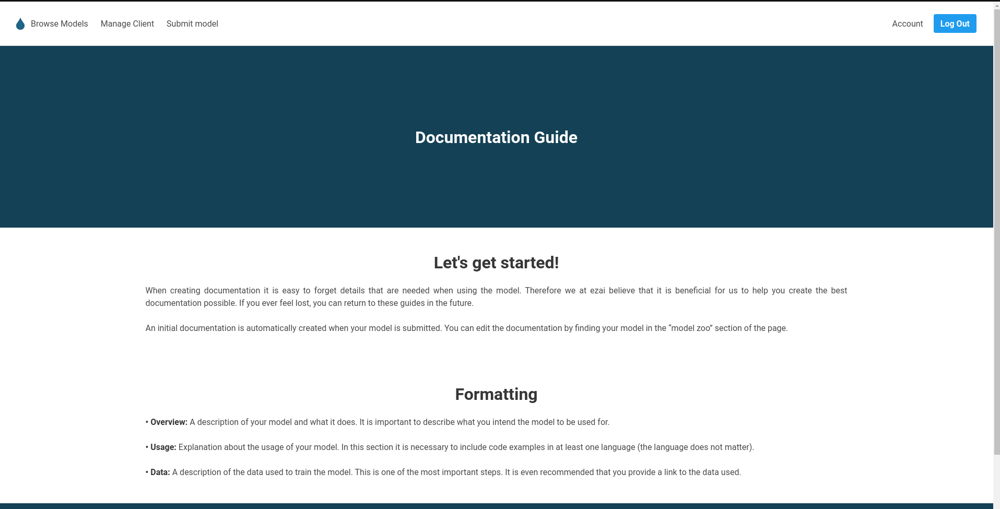

# EZAI - Åbo Akademi Project Course 2018

##### Note - This repo serves as archive and will not be updated.

This Project was done by:

- Henrik Ulfves - Project Manager
- Ben Eriksson - Product Owner
- Henrik Söderberg - Fullstack
- Sebastian Penttinen - Fullstack
- Matias Kytömäki - Backend
- Linus Jensén - Testing and Frontend

## Project idea

To build a platform for data scientists and machine learning enthusiasts to upload and sell their models.
The goal lies on making it easier for developers to sell their created models.

## How it works

A pre-made model can be uploaded by a user. When the model is uploaded a new api endpoint for the model is created by the system.
The user who created the model can then make the necessary documentation for the model in the included markdown editor on the site.
The user would then get paid per api call to the model.

## Tech Stack

This site is built using:

- [Django](https://www.djangoproject.com/), [Django REST framework](https://www.django-rest-framework.org/)
- [PostgreSQL](https://www.postgresql.org/)
- [Bulma](https://bulma.io/)
- [SendGrid](https://sendgrid.com/)
- [Auth0](https://auth0.com/)

## Pictures of the site

### Main page

### Browse Models

### Create Client

### Markdown Editor

### Submit Model

### Help Pages

